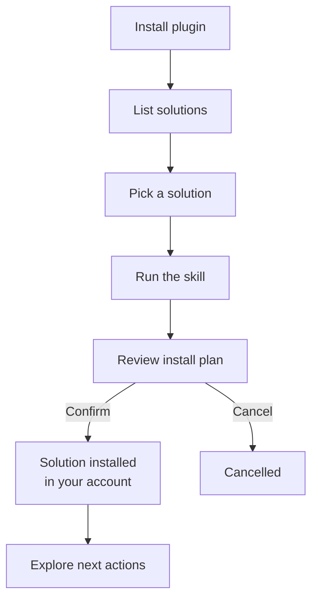
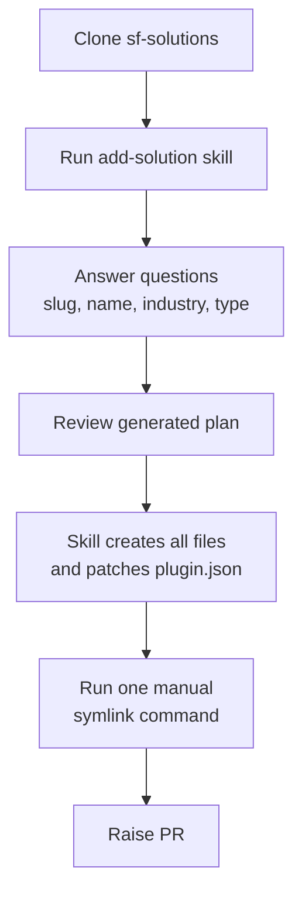

# Snowflake Industry Solutions

A catalog of Snowflake industry solutions. Each solution lives in its own repository; this repo provides the skills that install them into your Snowflake account via Cortex Code or Claude Code.

---

## How It Works

<details>
<summary>User flow</summary>



</details>

<details>
<summary>Contributor flow</summary>



</details>

---

## Getting Started

### For users: install a solution

1. Install this plugin in Cortex Code or Claude Code (see Quick Install below)
2. Run `$snowflake-solutions:list` to browse available solutions
3. Run `$snowflake-solutions:<slug>` to install one

### For contributors: add a new solution

Run `$snowflake-solutions:add-solution` in a CoCo session. The skill scaffolds all required files and patches `plugin.json`. Run `pre-commit install` after cloning to enable local commit checks.

---

## Solution Catalog

Solutions are discovered automatically from skill frontmatter. To see the full list:

```text
$snowflake-solutions:list
```

To add a new solution:

```text
$snowflake-solutions:add-solution
```

---

## Quick Install (via Cortex Code)

```bash
# Install the plugin
cortex plugin install https://github.com/Snowflake-Labs/sf-solutions.git

# Or load locally during development
cortex --plugin-dir /path/to/sf-solutions
```

Then in a Cortex Code session:

```text
# Browse the catalog
$snowflake-solutions:list

# Install a solution
$snowflake-solutions:<slug>

# Tear down a solution
$snowflake-solutions:<slug> teardown

# Post-install exploration guide
$snowflake-solutions:<slug> next

# Add a new solution to the catalog
$snowflake-solutions:add-solution

# Engineering conventions for building skills
$snowflake-solutions:solutions-scaffold
```

---

## Quick Install (via Claude Code)

```bash
claude plugin marketplace add https://github.com/Snowflake-Labs/sf-solutions.git
claude plugin install snowflake-solutions
```

Then in a Claude Code session:

```text
/snowflake-solutions:list
/snowflake-solutions:<slug>
/snowflake-solutions:<slug> teardown
/snowflake-solutions:<slug> next
/snowflake-solutions:add-solution
/snowflake-solutions:solutions-scaffold
```

Requires the [snowflake-cortex-code](https://claude.ai/plugins/snowflake-cortex-code) plugin (installed automatically as a dependency).

---

## Prerequisites

- Snowflake account. No trial? [Sign up free.](https://signup.snowflake.com/)
- Role with sufficient privileges to create objects (each solution documents its own requirements)

---

## Repository Structure

```text
sf-solutions/
├── .cortex-plugin/
│   ├── plugin.json               # CoCo plugin manifest
│   └── skills                    # symlink to ../skills
├── .cortex/
│   └── skills/
│       └── <name>                # per-skill symlink for local dev
├── .claude-plugin/
│   ├── plugin.json               # Claude Code plugin manifest
│   └── marketplace.json
├── .claude/
│   └── commands/
│       └── <name>.md             # Claude Code adapters
├── skills/                       # skill files (no solution code here)
│   ├── list/
│   ├── add-solution/
│   └── solutions-scaffold/
├── hooks/
│   ├── hooks.json
│   └── allow-solution-commands.sh
└── README.md
```

---

## Contributing

Start a CoCo session in this repo and run:

```text
$snowflake-solutions:add-solution
```

For engineering conventions and SKILL.md structure, see `$snowflake-solutions:solutions-scaffold` or [docs/DESIGN.md](docs/DESIGN.md).

---

## Framework Skills

| Skill | Purpose |
|-------|---------|
| [solutions-scaffold](skills/solutions-scaffold/SKILL.md) | Shared engineering conventions for building sf-solutions skills |

---

## Related Resources

- [Cortex Code](https://docs.snowflake.com/en/user-guide/cortex-code/cortex-code)
- [Claude Code](https://docs.anthropic.com/en/docs/claude-code/overview)
