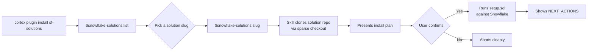

# Snowflake Industry Solutions

A **plugin catalog** for Snowflake industry solution accelerators. Each solution lives in its own dedicated repository; this repo provides the plugin skills that bootstrap and install them into your Snowflake account via Cortex Code or Claude Code.

Solution metadata is auto-discovered from skill frontmatter. The catalog grows as solutions are added via `$snowflake-solutions:add-solution`.

---

## How It Works

<details>
<summary>Flow diagram</summary>



</details>

---

## Getting Started

### For users — install a solution

1. Install this plugin in Cortex Code or Claude Code (see Quick Install below)
2. Run `$snowflake-solutions:list` to see available solutions
3. Run `$snowflake-solutions:<slug>` to install one

### For contributors — add a new solution

Run `$snowflake-solutions:add-solution` in a CoCo session — it scaffolds all required files and patches `plugin.json`. For engineering conventions and SKILL.md structure, run `$snowflake-solutions:solutions-scaffold`.

The pre-commit hooks enforce the PR checklist mechanically — run `pre-commit install` after cloning.

---

## Solution Catalog

Solutions are auto-discovered from skill frontmatter. To see the current list with full metadata (industry, Snowflake features, tags, status):

```
$snowflake-solutions:list
```

To add a new solution:

```
$snowflake-solutions:add-solution
```

---

## Quick Install (via Cortex Code)

```bash
# Install the plugin
cortex plugin install https://github.com/Snowflake-Labs/sf-solutions.git

# Or load locally during development
cortex --plugin-dir /path/to/sf-solutions
```

Then in a Cortex Code session:

```
# List all solutions with metadata
$snowflake-solutions:list

# Install a solution (slug from catalog)
$snowflake-solutions:<slug>
$snowflake-solutions:<slug> teardown
$snowflake-solutions:<slug> next

# Add a new solution to the catalog
$snowflake-solutions:add-solution
```

## Quick Install (via Claude Code)

```bash
# Add the marketplace
claude plugin marketplace add https://github.com/Snowflake-Labs/sf-solutions.git

# Install the plugin
claude plugin install snowflake-solutions
```

Then run:

```
/snowflake-solutions:list
/snowflake-solutions:<slug>
/snowflake-solutions:add-solution
```

Requires the [snowflake-cortex-code](https://claude.com/plugins/snowflake-cortex-code) plugin (auto-installed as dependency).

---

## Repository Structure

```
sf-solutions/
├── .cortex-plugin/
│   ├── plugin.json               # CoCo plugin manifest (skills[] array)
│   └── skills                    # SYMLINK → ../skills
├── .cortex/
│   └── skills/
│       └── <name>                # SYMLINK → ../../skills/<name>
├── .claude-plugin/
│   ├── plugin.json               # Claude marketplace manifest
│   └── marketplace.json
├── .claude/
│   └── commands/
│       └── <name>.md             # thin Claude adapters
├── skills/                       # CANONICAL skill content
│   ├── list/                     # catalog browser (frontmatter auto-discovery)
│   └── add-solution/             # scaffolds new solution skills
├── hooks/
│   ├── hooks.json
│   └── allow-solution-commands.sh
└── README.md
```

Skills use sparse checkout to clone solution runtime code from per-solution repos at invocation time — no solution code lives in this repo.

---

## Prerequisites

- Snowflake account (Enterprise edition recommended)
- Appropriate role with `CREATE DATABASE` / `SCHEMA` privileges
- Warehouse (default: `COMPUTE_WH`)

---

## Contributing

To add a new solution, start a CoCo session in this repo and run:

```
$snowflake-solutions:add-solution
```

The skill scaffolds all required files and patches `plugin.json`. For engineering conventions and SKILL.md structure, see `$snowflake-solutions:solutions-scaffold`.

For design decisions and repo architecture, see [docs/DESIGN.md](docs/DESIGN.md).

---

## Framework Skills

| Skill | Purpose |
|-------|---------|
| [solutions-scaffold](skills/solutions-scaffold/SKILL.md) | Shared engineering conventions (SKILL.md structure, plan mode gate, manifest schema, snow CLI rules) for building sf-solutions skills |

---

## Related Resources

- [Snowflake ML](https://docs.snowflake.com/en/developer-guide/snowflake-ml/overview)
- [Cortex AI Functions](https://docs.snowflake.com/en/user-guide/snowflake-cortex/llm-functions)
- [Cortex Code](https://docs.snowflake.com/en/user-guide/cortex-code/cortex-code)
- [Snowflake Notebooks](https://docs.snowflake.com/en/user-guide/ui-snowsight/notebooks)
